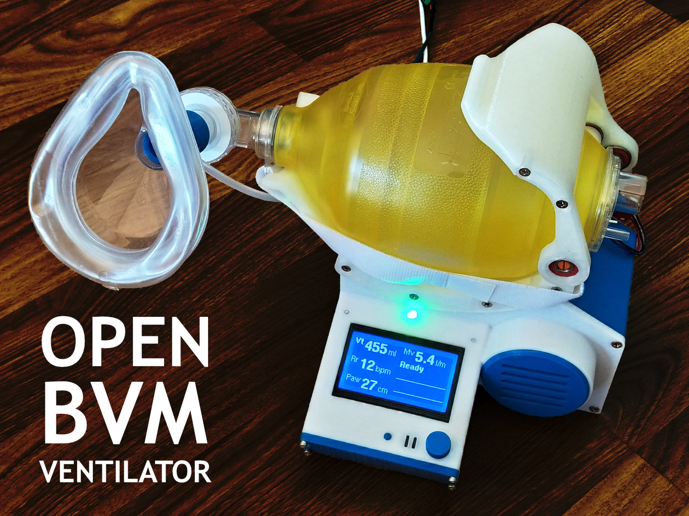

# Open BVM Ventilator project

The Open BVM Ventilator is a reference design and test platform for open source non-invasive bag valve mask ventilators. It features 3D printable parts and uses common off-the-shelf hardware and components.

## Specification

The Open BVM Ventilator is non-invasive and operates in universal mode (the combination of spontaneous pressure triggered ventilation with pressure-limited mandatory ventilation). It has been designed to meet all the applicable requirements outlined in the [Ventilator for COVID-19 use in Australia](spec/ventilator-covid-19-use-australia.pdf) document published on the [Australian Government, Department of Health, Therapeutic Goods Administration](https://www.tga.gov.au/ventilator-covid-19-use-australia) website.

### Assumptions

At the time this design was initiated it was assumed that early non-invasive ventilation with supplementary oxygen is beneficial for treating COVID-19 patients.

In order to meet all the requirements in the above document it is assumed that:

1. Oxygen will be provided to the bag via an externally regulated source (like an oxygen cylinder or wall outlet).
2. A HEPA exhalation filter will be installed between the manifold and the mask.
3. A PEEP regulator will be installed on the valve output to provide positive end-expiratory pressure.
4. An additional air hose may be used to connect the mask to the patient. However this hose should be connected between the bag and the valve to limit the amount of dead space in the gas exchange.
5. The mask will be strapped to patient in order to provide an airtight seal.

### Capabilities

The current Open BVM Ventilator design has the following capabilities:

* A real time system where all controls can be adjusted and provide live feedback though mechanical output and the user interface.
* Calculated minute volume is displayed after each inspiratory cycle.
* Pressure-limited mandatory ventilation is controlled via the respiratory rate and tidal volume.
* Spontaneous ventilation is triggered via negative pressure on the manifold attached to the pressure sensor. 
* Positive end expiratory pressure (PEEP) is provided by a regulator attachment on the valve output.
* Quick adjustment of Tidal Volume (Vt), Respiratory Rate (Rr) and Plateau Airway Pressure (Paw) is available on the home page.
* Airway pressure safety is set via the maximum pressure limit.
* Pressurised air is not required. Therefore the unit can be operated outside of an ICU using only bottled oxygen and a power supply.
* All ventilator controls are accessed using the LCD display, stop button and encoder on the [Reprap Discount Full Graphic Smart Controller](https://reprap.org/wiki/RepRapDiscount_Full_Graphic_Smart_Controller).
* Both visual and audible alarms are generated and logged on the events page.
* 12v power can be provided via an AC adapter or external battery.
* All parts can be 3D printed with food safe PLA plastic.

These capabilities have been verified with static tests but will require more comprehensive dynamic testing to be considered validated. These dynamic tests are underway, however they require at least 14 days to complete.

### Outstanding Issues

1. The tidal volume is currently estimated and needs calibration.
2. Maximum inspiratory and expiratory flow is limited to 35 l/min by the maximum stepper motor RPM and torque. This may or may not be adequate for clinical use and therefore may require selection of a different stepper motor and driver combination to achieve the 100 l/min capability specified.
3. The current stepper driver is noisy and should to be replaced with a TMC2209 or equivalent. However this would require an cooling fan.

## Hardware

The Open BVM Ventilator is comprised of 25 x 3D printed parts and various off-the-shelf hardware, electronic components and fasteners.

A list of all the required hardware, fasteners, electronic components and 3D printed parts can be found in the **[Bill of Materials](bom/BOM.md)**.

## Firmware

## Arduino Uno Shield

This repository contains the Arduino firmware source code, 3D printable STL files,  original CAD files, electronic circuit and bill of materials.
